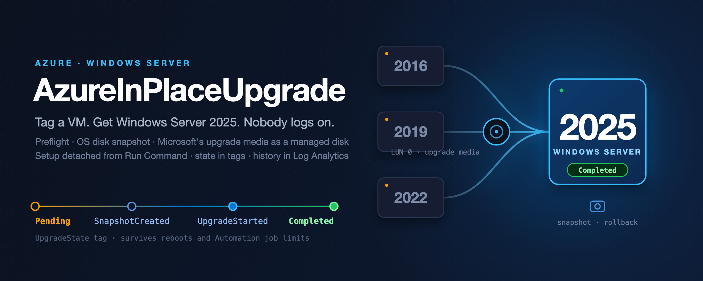
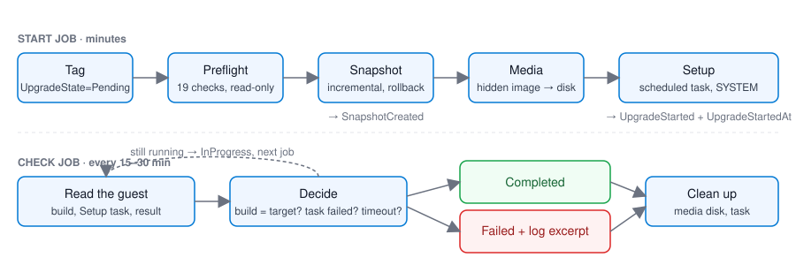

<p align="center"></p>

<p align="center">
  <a href="https://github.com/simon-vedder/azure-vm-inplace-upgrade/actions/workflows/ci.yml"></a>
  <a href="https://www.powershellgallery.com/packages/AzureInPlaceUpgrade"></a>
  
  
  
</p>

**Unattended in-place upgrades of Windows Server on Azure VMs. One by name, or a tagged fleet from a runbook.**

Name a VM and a target, and AzureInPlaceUpgrade takes it from Windows Server 2016, 2019 or 2022
to Windows Server 2025 without anyone logging on: read-only preflight, OS disk snapshot, Microsoft's upgrade
media attached as a managed disk, Windows Setup started detached from Run Command, a state machine
that survives reboots and Azure Automation's job limits, in-guest validation, cleanup, and a
Log Analytics workbook to watch the whole fleet.

<p align="center"></p>

## Why

- Microsoft documents the Azure in-place upgrade as a **manual, per-VM** procedure: build a media
  disk, attach it, RDP in, run `setup.exe`, watch the boot diagnostics screenshot.
- The Windows Server 2025 **feature update over Windows Update** is, by Microsoft's own
  announcement, an administrator clicking *Download and install*. Azure Update Manager has no
  upgrade classification.
- Windows Server 2016 leaves extended support on **12 January 2027**, and that population can only
  reach 2025 through the media disk.

## Features

- **Preflight you can trust.** Nineteen read-only checks per VM, from power state and disk type to
  edition, installation type, language, free space, pending reboot, domain controller, cluster,
  activation channel and media availability in the region. Returns an object, not a log.
- **Two engines.** `MediaDisk` (default): Microsoft's hidden upgrade image as a managed data disk,
  no network needed, every documented source version. `FeatureUpdate`: the Windows Server 2025
  feature update through the Windows Update Agent, no media disk, WS2019 and WS2022.
- **Solves the `0xC1900215` trap.** Unattended Setup cannot choose between the Core and Desktop
  Experience images on the media and aborts. The module reads the `install.wim` metadata, matches
  the guest's edition and installation type and passes `/installfrom` and `/imageindex`.
- **State in tags, history in Log Analytics.** `Pending → SnapshotCreated → UpgradeStarted →
  Completed | Failed`, visible in the portal and Resource Graph. One record per transition in a
  custom table, with a workbook.
- **Built for Azure Automation.** `Start` and `Check` are separate short jobs, so the three-hour
  cloud job limit never bites. The identity is customer-owned, the role is the exact list of actions.
- **Idempotent and safe by default.** Reruns reuse snapshot and media disk, a running Setup is never
  started twice, nothing changes state without `UpgradeState=Pending`, `-WhatIf` works everywhere.
- **Honest about limits.** [When not to use this](docs/when-not-to-use-this.md) and
  [KNOWN-ISSUES.md](KNOWN-ISSUES.md) list every sharp edge found in the lab.

## Quick start

```powershell
Install-Module AzureInPlaceUpgrade -AllowPrerelease
Connect-AzAccount
Set-AzContext -Subscription '<subscription name>'

# 1. What can a Windows Server 2016 guest (build 14393) be upgraded to?
Get-InPlaceUpgradeTarget -SourceBuild 14393 | Select-Object Name, DisplayName

# 2. Read-only preflight. A short Run Command probe in the guest, nothing changes.
$r = Test-InPlaceUpgradeReadiness -ResourceGroupName rg-apps-prod-weu -Name vm-app-prod-weu-01 -Target WS2025
$r.Decision                                          # Eligible | NotEligible | AlreadyAtTarget
$r.Checks | Format-Table Name, Result, Detail -AutoSize

# 3. Start it. Snapshot, media disk, Setup. Returns in minutes. No tags involved.
$s = Start-InPlaceUpgrade -ResourceGroupName rg-apps-prod-weu -Name vm-app-prod-weu-01 -Target WS2025

# 4. Finish. Run every 20-30 minutes until Completed or Failed. Start printed this line for you.
Complete-InPlaceUpgrade -ResourceGroupName rg-apps-prod-weu -Name vm-app-prod-weu-01 -Target WS2025 `
    -Snapshot $s.Snapshot -MediaDisk $s.MediaDisk -StartedAt $s.StartedAt | Select-Object VMName, Result, Reason

# Or, outside Azure Automation, start and wait in one call
Invoke-InPlaceUpgrade -ResourceGroupName rg-apps-prod-weu -Name vm-app-prod-weu-01 -Target WS2025 -TimeoutMinutes 300 -Confirm:$false -Verbose
```

### The module never reads a tag

Every cmdlet takes `-ResourceGroupName`, `-Name` and `-Target`, or a VM object on the pipeline.
Nothing is inferred from resource metadata, and nothing is written to the VM. `Start` returns what it
did, and `Complete` takes those values back:

```powershell
$r = Start-InPlaceUpgrade -ResourceGroupName rg-apps-prod-weu -Name vm-app-prod-weu-01 -Target WS2025
# Start also prints the finished Complete line; $r.ResumeCommand holds the same string.

Complete-InPlaceUpgrade -ResourceGroupName rg-apps-prod-weu -Name vm-app-prod-weu-01 -Target WS2025 `
    -Snapshot $r.Snapshot -MediaDisk $r.MediaDisk -StartedAt $r.StartedAt
```

`Invoke-InPlaceUpgrade` does start and wait in one call and keeps the state in the process, so an
interactive upgrade needs none of this.

Tags belong to the orchestrator. The runbook selects VMs by `UpgradeTarget`, `UpgradeState` and
`UpgradeRing`, reads the target off the tag, passes it as `-Target`, and writes the progress back
with `Update-AzTag` so the next `Check` job can finish the machine. A second `Start` on a running
upgrade is stopped by the preflight, which sees Setup running in the guest rather than trusting a tag.

What Start returns on success: the VM in `UpgradeStarted`, an incremental OS disk snapshot
named in `UpgradeSnapshot`, the media disk named in `UpgradeMediaDisk`. What Complete does on a
final state: sets `Completed` or `Failed`, removes the media disk and the scheduled task, keeps the
snapshot until you delete it. On a Setup failure the result carries the tail of `setuperr.log` and
the compat scan blocks.

## Deploy the orchestrator

[](https://portal.azure.com/#create/Microsoft.Template/uri/https%3A%2F%2Fraw.githubusercontent.com%2Fsimon-vedder%2Fazure-vm-inplace-upgrade%2Fmain%2Fdeploy%2Fazuredeploy.json)

```bash
az deployment sub create -l westeurope -f deploy/main.bicep \
  -p moduleVersion=0.3.0 targetResourceGroupName=rg-apps-prod-weu ring=Ring0 maxParallel=3
```

One subscription-scope deployment creates an Automation Account with a system-assigned identity,
the least-privilege custom role *Azure VM In-Place Upgrade Operator*, the module import, the
runbook, a `Check` schedule every 20 minutes and a daily `Start` schedule that is only linked when
you say so, plus a Log Analytics workspace, the `InPlaceUpgrade_CL` table, a data collection
endpoint and rule, and the workbook *In-place upgrades*. Details in [deploy/README.md](deploy/README.md).

The runbook is a thin wrapper: sign in with the identity, discover VMs by tag, apply `-Ring` and
`-MaxParallel` (which counts VMs already in progress), call the module per VM, summarise.

## How it works

Two decisions make the unattended path possible, both recorded in [docs/decisions](docs/decisions):

- **Setup runs from a scheduled task**, not from Run Command. Run Command is capped at 90 minutes
  and dies with the first reboot ([ADR 0001](docs/decisions/0001-scheduled-task-over-run-command.md)).
- **Start and Check are separate jobs**, because Azure Automation cancels cloud jobs after three
  hours ([ADR 0003](docs/decisions/0003-start-and-check-are-separate-jobs.md)).

Validation reads `CurrentBuildNumber` from the guest registry. ARM keeps reporting the original
image forever; the guest does not lie. The engine choice, the tag design and the module-plus-runbook
split have ADRs of their own.

## Tags

| Tag | Values | Meaning |
|---|---|---|
| `UpgradeTarget` | `WS2025`, `WS2022`, `WS2019` | what is wanted |
| `UpgradeState` | `Pending` → `SnapshotCreated` → `UpgradeStarted` → `Completed` \| `Failed` | where the VM is; **`Pending` is the approval** |
| `UpgradeRing` | free text, e.g. `Ring0` | optional; the runbook can be told to process one ring |
| `UpgradeStartedAt` | Unix epoch seconds, written by the tool | timeout base for Check |
| `UpgradeSnapshot` | snapshot name, written by the tool | rollback point of the current run |
| `UpgradeMediaDisk` | `<resource group>/<disk name>`, written by the tool | what Complete cleans up (MediaDisk engine) |
| `UpgradeEngine` | `MediaDisk` \| `FeatureUpdate`, written by the tool | which engine Start used |

## Supported paths

Shipped as [`targets.json`](src/AzureInPlaceUpgrade/targets.json). A tag value that is not a key
here never reaches an Azure image. Same edition, same installation type, `64-bit`, `en-US` only;
Standard and Datacenter; Server and Server Core. Windows Server *Azure Edition* is out of scope.

| Target | Source | MediaDisk | FeatureUpdate |
|---|---|---|---|
| `WS2025` | Windows Server 2022 | ✅ verified, Desktop Experience and Core | ✅ verified once |
| `WS2025` | Windows Server 2019 | ✅ verified, through Azure Automation | documented |
| `WS2025` | Windows Server 2016 | ✅ verified | not available |
| `WS2025` | Windows Server 2012 R2 | documented by Microsoft | not available |
| `WS2022` | Windows Server 2016, 2019 | documented by Microsoft | not available |
| `WS2019` | Windows Server 2012 R2, 2016 | documented by Microsoft | not available |

"Verified" means the path ran end to end in this project's lab on a Marketplace VM; the runs,
timings and result objects are in [docs/verification.md](docs/verification.md). The media disk
finishes in 37 to 43 minutes; the feature update took two to three hours on the same image.

## Permissions

The preflight needs these actions on the VM scope (Reader is not enough, Virtual Machine
Contributor is far too much):

```
Microsoft.Compute/virtualMachines/read
Microsoft.Compute/virtualMachines/instanceView/read
Microsoft.Compute/virtualMachines/runCommand/action
Microsoft.Compute/locations/publishers/artifacttypes/offers/skus/versions/read
```

Start and Complete add `virtualMachines/write`, `disks/read|write|delete`, `snapshots/read|write`,
`networkInterfaces/join/action` and `Microsoft.Resources/tags/write`. The custom role in
`deploy/main.bicep` is exactly that list.

## Status

Pre-release `0.3.1-preview`. Five upgrade paths, the Automation path with telemetry and the Bicep
deployment are lab-verified on Marketplace VMs. Not yet verified: the 2012 R2 source, the WS2022
and WS2019 targets, Trusted Launch VMs, imported or retail-activated guests. Read
[docs/when-not-to-use-this.md](docs/when-not-to-use-this.md) before tagging production, and
[KNOWN-ISSUES.md](KNOWN-ISSUES.md) for what to expect.

## Documentation

- **[Command reference](docs/commands/README.md)** - every command with its parameters, permissions and examples
- [Verification log](docs/verification.md), the runs behind every ✅
- [Known issues and sharp edges](KNOWN-ISSUES.md)
- [When not to use this](docs/when-not-to-use-this.md)
- [Architecture decisions](docs/decisions)
- [Deployment](deploy/README.md), [releasing](docs/release.md), [contributing](CONTRIBUTING.md), [security](SECURITY.md), [changelog](CHANGELOG.md)

## License

MIT. The product keys in the target matrix are Microsoft's public KMS client setup keys; they
activate nothing and are listed by Microsoft for exactly this purpose.
